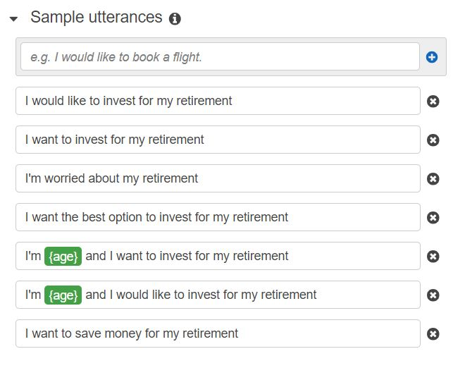
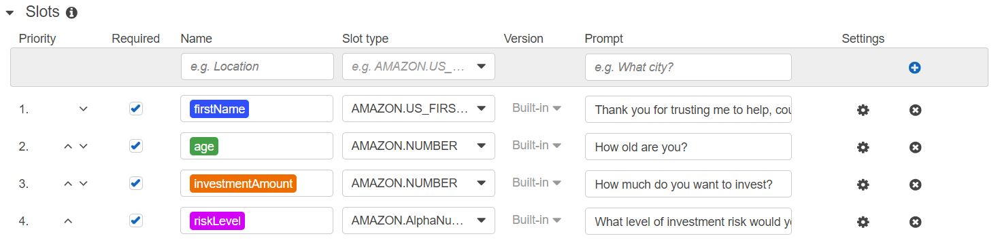

# AWS Robo Advisor

This repo represents a simple Robo advisor created with AWS Lambda and AWS Lex. Based on user's answers, Robo adviser provides best portfolio for retirement plan.

## Approach

1. Create advisor bot using AWS Lex

2. Create and deploy lambda function using AWS Lambda

3. Test Robo advisor

---

## Technologies

This project leverages the following tools:

- [AWS Lambda](https://aws.amazon.com/lambda/) - is a serverless, event-driven compute service.

- [AWS Lex](https://aws.amazon.com/lex/) - to design, build, test, and deploy conversational interfaces in applications.

---

## Input data and how it works

Examples of how it works you can find in the folder `Video`.

Robo adviser asks questions and user provides answers:

Example:

```
User: I want to save money to my retirement
Bot: Thank you for trusting me to help. Couls you please give me your name?
User: John
Bot: How old are you?
User: 30
Bot: Ho much do you want to invest?
User: 10000
Bot: What level of investment risk would you like to take? (None, Low, Medium, High)
User: None
Bot: Thank you for your information, John. We recommend you an investment portfolio: 100% bonds (AGG) and 0% equities (SPY)

```

---

## Types of portfolios

```
None: “100% bonds (AGG), 0% equities (SPY)”
Low: “60% bonds (AGG), 40% equities (SPY)”
Medium: “40% bonds (AGG), 60% equities (SPY)”
High: “20% bonds (AGG), 80% equities (SPY)”
```

## Utterances



## Slots



## Test events

All test are passed. Pls, refer to `Video/Test_events.mp4`

---

## Contributors

Vladislav Glupak - [Linkedin](https://www.linkedin.com/in/vladislav-glupak/)

---

## License

It is an Open-source analysis.
